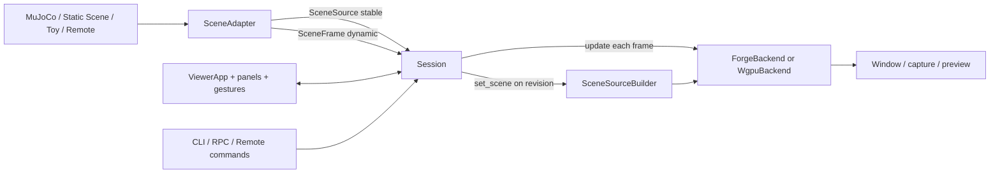

# forge-viewer 架构与维护导航

> **定位**：面向开发、排障和扩展的长期入口，不是宣传性概览。
> **核对快照**：2026-08-26，分支 `main`，基线提交
> `0a8178b47f8c5a3249d6b28428981da1d4165a5c`，版本 `0.1.0`。
> 当前工作树另含 2026-08-26 审查中尚未提交的契约与 bug 修复；合入后应把这里的
> commit 更新到实际提交。
> **事实优先级**：当前源码 / 构建脚本 / 测试 → 本套已核对且固定 commit 的报告 →
> `AGENTS.md` 与项目文档 → 未复核旧材料（只作线索）。

## 一分钟结论

| 问题 | 当前结论 | 先看 |
|---|---|---|
| 项目是什么？ | 一个以 Forge/WGPU 为渲染端、以 adapter 接入 MuJoCo 或任意 scene source 的后端中立 3D viewer | [01 定位与仓库结构](01-scope-and-repository.md) |
| 一帧如何流动？ | adapter 分离发布稳定 `SceneSource` 与动态 `SceneFrame`，`Session` 调度后交给共享 builder 和 renderer | [02 运行时组合](02-runtime-composition.md) |
| 哪些对象是核心契约？ | `Session`、`SceneAdapter`、`SceneSource`、`SceneFrame`、`RenderBackend`；身份 ID 与数组 slot 必须分开 | [03 场景契约](03-scene-contracts.md) |
| 想接物理或远程源从哪里下手？ | 先实现最小 adapter，再按 capability 增量实现；用 conformance 校验 | [05 Adapter 与传输](05-adapters-workspace-remote.md) |
| Forge 与 WGPU 是否两套管线？ | 底层编码确实不同，但共享 builder、类型与可观察契约；不应强求源码同构 | [06 渲染管线](06-render-pipelines.md) |
| `enable_depth_rendering` 是否该改名？ | 不该直接改；它属于 `mujoco.Renderer` 兼容 facade，内部通用开关已经用 `set_flag` | [08 公共 API](08-public-api-and-extension.md) |
| 如何验证修改？ | 迭代跑最小测试，定稿跑 `make check`；渲染、MuJoCo 各有额外门禁 | [09 开发与验证](09-development-and-verification.md) |
| 主要长期风险是什么？ | capability 过粗、稳定 ID/slot 漂移、双后端重复、pickle 信任边界与 GPU 环境覆盖 | [10 风险与漂移](10-risks-and-drift.md) |

## 系统全景

## 文档导航

| 文档 | 解决的问题 | 典型使用时机 |
|---|---|---|
| [01 定位与仓库结构](01-scope-and-repository.md) | 项目边界、目录和术语是什么 | 第一次进入仓库 |
| [02 运行时组合](02-runtime-composition.md) | 构造、主循环、帧流和资源所有权如何连接 | 排查启动、退出、重复更新 |
| [03 场景契约](03-scene-contracts.md) | 稳定结构、动态帧、坐标和身份规则 | 新增字段、定位错位或矩阵问题 |
| [04 Session 与命令](04-session-and-commands.md) | 状态机、命令路由、选择与模拟调度 | 修改 UI 行为或 command |
| [05 Adapter、Workspace 与 Remote](05-adapters-workspace-remote.md) | 接入后端、组合场景与远程传输 | 新 adapter、远程编辑、模型组合 |
| [06 渲染管线](06-render-pipelines.md) | 两个 renderer 的共享与差异 | pass、shader、纹理、capture 修改 |
| [07 UI 与生命周期](07-ui-and-lifecycle.md) | UI controller、相机与资源释放 | 交互、窗口、嵌入式使用 |
| [08 公共 API 与扩展](08-public-api-and-extension.md) | 兼容 facade、命名和扩展面 | API 评审、第三方接入 |
| [09 开发与验证](09-development-and-verification.md) | 最小验证到完整门禁如何选 | 实现、回归、交付 |
| [10 风险与漂移](10-risks-and-drift.md) | 哪些结论不稳定、哪里容易再次漂移 | 升级依赖、设计评审、发版前 |

## 核心源码直达

| 主题 | 入口 |
|---|---|
| 公共场景类型 | [types.py](../../src/forge_viewer/types.py)、[adapters/base.py](../../src/forge_viewer/adapters/base.py) |
| 应用状态与命令 | [session.py](../../src/forge_viewer/session.py)、[commands.py](../../src/forge_viewer/commands.py) |
| 作者场景 | [scene.py](../../src/forge_viewer/scene.py)、[scene_io.py](../../src/forge_viewer/scene_io.py) |
| MuJoCo 接入 | [mujoco_adapter.py](../../src/forge_viewer/adapters/mujoco_adapter.py) |
| Workspace 与 Remote | [workspace.py](../../src/forge_viewer/adapters/workspace.py)、[remote.py](../../src/forge_viewer/remote.py) |
| 渲染公共层 | [render/backend.py](../../src/forge_viewer/render/backend.py)、[render/builder.py](../../src/forge_viewer/render/builder.py) |
| Forge / WGPU | [render/forge/backend.py](../../src/forge_viewer/render/forge/backend.py)、[render/webgpu/backend.py](../../src/forge_viewer/render/webgpu/backend.py) |
| UI 与组合根 | [ui/app.py](../../src/forge_viewer/ui/app.py)、[composition.py](../../src/forge_viewer/composition.py) |
| 公共离屏 Renderer | [renderer.py](../../src/forge_viewer/renderer.py)、[control_rpc.py](../../src/forge_viewer/control_rpc.py) |
| 契约与门禁 | [test_layering.py](../../tests/test_layering.py)、[conformance.py](../../src/forge_viewer/adapters/conformance.py)、[Makefile](../../Makefile) |

## 推荐阅读顺序

- 第一次接触：01 → 02 → 03 → 09 → 当前任务对应章节。
- 新接 adapter：03 → 05 → 04 → 09。
- 改渲染：03 → 06 → 09 → 10。
- 改 UI/命令：04 → 07 → 08。
- 排查远程或生命周期：02 → 05/07 → 10。

## 证据标记与维护规则

| 标记 | 含义 | 可否据此修改代码 |
|---|---|---|
| 已核对 | 本快照直接由源码、构建脚本、测试或 CI 验证 | 可以，但仍应读目标源码 |
| 观察到 | 从提交历史、目录或测试覆盖归纳 | 需要团队判断 |
| 建议 | 尚未强制的维护约定 | 先在 MR 中说明 |
| 待确认 | 存在矛盾、平台差异或覆盖缺口 | 不应当作稳定契约 |

维护本报告时：

1. 更新首页日期、分支、完整 commit 和版本；工作树修复合入后不要继续引用旧基线。
2. 先查源码、测试、Makefile 与 CI，再引用上下文文档。
3. 公共 API、capability、帧字段或 pass 顺序变化时，同步更新相关章节。
4. 旧结论与源码冲突时，在风险与漂移章登记，不静默复制。
5. 一次性复现、测试输出和修复流水放日期报告，不写入长期章节。

## 版本控制提醒

本目录属于 `worklog/` 调研资产，不应随普通功能提交进入 MR。若要成为团队维护文档，需评审后迁移到
`agent_context/` 或 `docs/` 并注册索引。
